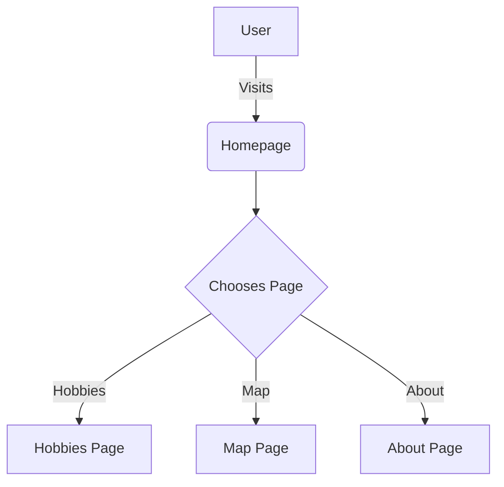

# Production Engineering - Week 1 - Portfolio Site

Welcome to the MLH Fellowship! During Week 1, you'll be using Flask to build a portfolio site. This site will be the foundation for activities we do in future weeks so spend time this week making it your own and reflect your personality!


## Tasks

Once you've got your portfolio downloaded and running using the instructions below, you should attempt to complete the following tasks.

For each of these tasks, you should create an [Issue](https://docs.github.com/en/issues/tracking-your-work-with-issues/about-issues) and work on them in a new [branch](https://docs.github.com/en/pull-requests/collaborating-with-pull-requests/proposing-changes-to-your-work-with-pull-requests/about-branches). When the task has been completed, you should open a [Pull Request](https://docs.github.com/en/pull-requests/collaborating-with-pull-requests/proposing-changes-to-your-work-with-pull-requests/about-pull-requests) and get another fellow in your pod to give you feedback before merging it in.

*Note: Make sure to include a link to the Issue you're progressing on inside of your Pull Request so your reviewer knows what you're progressing on!*

### GitHub Tasks
- [x] Create Issues for each task below
- [x] Progress on each task in a new branch
- [x] Open a Pull Request when a task is finished to get feedback

### Portfolio Tasks
- [x] Add a photo of yourself to the website
- [x] Add an "About youself" section to the website.
- [x] Add your previous work experiences
- [x] Add your hobbies (including images)
- [x] Add your current/previous education
- [x] Add a map of all the cool locations/countries you visited

### Flask Tasks
- [x] Get your Flask app running locally on your machine using the instructions below.
- [x] Add a template for adding multiple work experiences/education/hobbies using [Jinja](https://jinja.palletsprojects.com/en/3.0.x/api/#basics)
- [x] Create a new page to display hobbies.
- [x] Add a menu bar that dynamically displays other pages in the app


## Getting Started

You need to do all your progress here.

## Installation

Make sure you have python3 and pip installed

Use the package manager [pip](https://pip.pypa.io/en/stable/) to install all dependencies!

You can use either `venv` or `conda` for your virtual environment. (Note: If you use conda and follow the exact instructions, pip is installed with it.)

### Using Conda

1. [Download and install Anaconda](https://www.anaconda.com/products/distribution) if you don’t have it.
2. Create and activate a new environment:
    ```bash
    conda create -n myenv python=3.10
    conda activate myenv
    ```
3. Install dependencies:
    ```bash
    pip install -r requirements.txt
    ```

### Using venv

1. Create and activate a virtual environment:
    ```bash
    python3 -m venv venv
    source venv/bin/activate
    ```
2. Install dependencies:
    ```bash
    pip install -r requirements.txt
    ```

## Usage

Create a .env file using the example.env template (make a copy using the variables inside of the template)

Start flask development server
```bash
$ export FLASK_ENV=development
$ flask run
```

You should get a response like this in the terminal:
```
❯ flask run
 * Environment: development
 * Debug mode: on
 * Running on http://127.0.0.1:5000/ (Press CTRL+C to quit)
```

You'll now be able to access the website at `localhost:5000` or `127.0.0.1:5000` in the browser! 

*Note: The portfolio site will only work on your local machine while you have it running inside of your terminal. We'll go through how to host it in the cloud in the next few weeks!* 

## Contribution Guidelines

Contributions are welcome! To contribute:

- Fork the repository
- Create a new branch for your feature or bugfix
- Open a pull request describing your changes

For more details, see [CONTRIBUTING.md](CONTRIBUTING.md) (coming soon).

Please follow the code of conduct and respect the review process.

## Introduction

A personal portfolio site built with Flask for the MLH Fellowship. This project showcases my background, experiences, and interests.

## Description

This portfolio site features dynamic sections for About Me, Work Experience, Education, Hobbies, and an interactive map of places I’ve visited. It demonstrates Flask, Jinja templating, and modern web development practices. The site is designed to be easily extensible and contributor-friendly.

## Prerequisites

- Python 3.10+
- pip
- (Optional) [Anaconda](https://www.anaconda.com/products/distribution) for environment management

## Technologies Used

- Flask
- Jinja2
- Leaflet.js
- HTML/CSS

<!-- ## Visuals


 -->

## QuickStart

1. Clone the repository:
    ```bash
    git clone https://github.com/your-username/your-repo.git
    cd your-repo
    ```

2. Create and activate a virtual environment (choose one):

   **Using Conda:**
   ```bash
   conda create -n myenv python=3.10
   conda activate myenv
   ```

   **Using venv:**
   ```bash
   python3 -m venv venv
   source venv/bin/activate
   ```

3. Install dependencies:
    ```bash
    pip install -r requirements.txt
    ```

4. Run the Flask app:
    ```bash
    flask run
    ```

5. Open [http://127.0.0.1:5000/](http://127.0.0.1:5000/) in your browser.

## Advanced Usage

- Add new hobbies, work experiences, or places by editing `app/data.py`.
- Customize templates in `app/templates/`.
- For more documentation, consider adding a `docs/` folder.

## Configuration

- Copy `.env.example` to `.env` and fill in any required environment variables.
- Example variables:
    ```
    FLASK_ENV=development
    SECRET_KEY=your_secret_key
    ```
- You can add more configuration options as your project grows.

## Folder Structure

```
app/
  __init__.py
  data.py
  templates/
  static/
tests/
README.md
requirements.txt
```

## Automated Tests

To run tests (if available):

```bash
pytest
```

*Note: Automated tests coming soon!*

<!-- ## Roadmap

- [ ] Add blog section
- [ ] Add contact form
- [ ] Improve accessibility
- [ ] Add more automated tests
- [ ] Enhance map features -->

## Issue & Pull Request Templates

To help maintain consistency, this project uses GitHub’s issue and pull request templates.

- Bug reports, feature requests, and other issues should use the templates in `.github/ISSUE_TEMPLATE/`.
- Pull requests should use the template in `.github/PULL_REQUEST_TEMPLATE.md`.

If you have suggestions for improving these templates, feel free to open a PR!

## Diagrams

For architecture and workflow diagrams, this project recommends using [Mermaid](https://mermaid-js.github.io/) for easy-to-edit, code-based diagrams.

Example (replace with your own as needed):



Add your own diagrams to help explain project structure or user journeys!

## SOLID Principles

This project aims to follow SOLID principles for better maintainability and scalability:

- **Single Responsibility Principle:** Each module or function has one responsibility.
- **Open/Closed Principle:** Code is open for extension but closed for modification.
- **Liskov Substitution Principle:** Components can be replaced with their subtypes without breaking the application.
- **Interface Segregation Principle:** Prefer small, specific interfaces over large, general ones.
- **Dependency Inversion Principle:** Depend on abstractions, not on concrete implementations.

Applying these principles helps keep the codebase clean and easy to contribute to.

## Development Log

See the `docs/` folder for a session-by-session breakdown of project progress.
